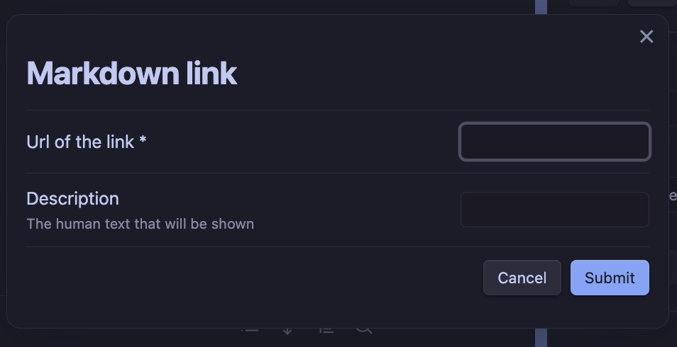

This release contains one little change that was easy to make, but I think that it unlocks a very interesting use case for modal forms.
There is a not very well documented feature in the FormEditor that allows to define a specific (and simple) template linked to that form.
I implemented it partially for fun, because I love coding parsers but also partially because many times I only need very basic templating 
functionality and I don't want to have to write another templater template.
Also, I find very appealing the idea of having both the form and the template visible and linked in the same place, which is not the case when you use templater templates.
Up until now, the only thing you can use this templates for was for creating new notes from that template.
You trigger a command, select the form to use, fill it and the template is used to create the note.

But I find myself many times defining a very simple for for easier the insertion of certain data in an existing note.
However, for that I was forced to first create the form then create a templater template that uses that form (whith all the boilerplate it entails)
and then either tell templater to create a command for that template or use the insert template from templater command.
When I saw how easy is to create commands that insert text in the current note I thought it was a no brainer to not take advantage of that with the form templates.

So that is the little but big improvement in this release. You can now use the form templates to insert text in the current note at the cursor position.

To give an example, I have a very simple form for inserting an external link.
While the experience of doing this in the Obsidian desktop app is fine, it is a bit tedious to do on mobile.

My form looks as simple as this:


And the template is also very simple, just:

```
[{{title}}]({{url}})
```

Now, I can trigger a command that will insert the template in the current note at the cursor position after filling and submitting the form.

Hope you find this useful. I'm already using it a lot.
