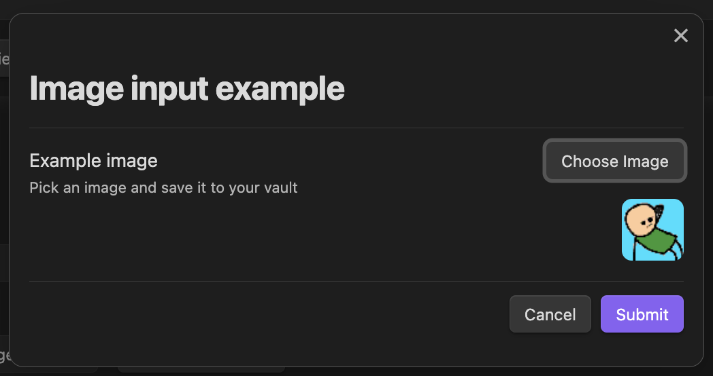
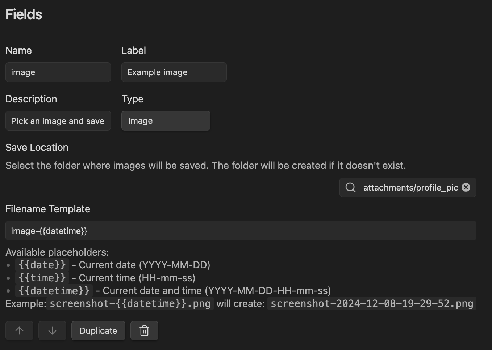

## Introducing Image Input

This release introduces a brand new input type: the image input! This new component allows you to upload images directly through your forms, automatically saving them to your vault.
I'm particularly excited about this new feature because I already have a lot of usecases for it on my daily life (I like to keep a record of the restaurants I visit and the meals I eat there).
The possibilities it opens are big and I'm really excited about seeing what new and more visual experiences you can create using it.
I also think that having a specialized way of adding images to your notes/templates is better than the obsidian way in a lot of situations.

### What's New

The image input is a powerful new addition to our form inputs family that lets you:

- Save images directly to your vault
- Preview the image
- Atomically define where each image will be saved for each input
- Use templates for file naming with date/time placeholders

Here's how it looks in action:


There is also a new helper in the FormResult object that simplifies the creation of markdown links to the image.
For example, if you have a field called `image` in your form result, you can use it like this in your templates:

```
<% result.image.link %>
```

### Using the Image Input

Adding an image input to your form is very straightforward using the FormBuilder. Here's an example screenshot:


The configuration has two main settings:

- `filenameTemplate`: Define how your files will be named. You can use placeholders like `{{date}}`, `{{time}}`, or `{{datetime}}`.
- `saveLocation`: Specify where in your vault the image will be saved. Don't worry if the folder doesn't exist - it will be created automatically!

### Drawbacks

As with every first version of every new feature, there is an important drawback:
**the image input is eager to save the image**.
This means that the image will be saved as soon as you select it, even if the form is not submitted, or if you pick a different image.
This is a tradeoff that simplified the implementation and makes some scenarios simpler , like using the image in a markdown block or in other dynamic inputs.

It is also worth mentioning that the value you get in the form result is not a TFile directly but a wrapped TFile object.
This is because a lot of places assume it is safe to just serialize the form results to JSON, which is not the case for the TFile object.
The wrapped TFile object has direct access to the most essential properties of the file, like `path`, `name`, `basename`, and `extension`.
The wrapped TFile is also available through the `TFile` property in the wrapping class `FileProxy`.

Here is an example of how you can use the wrapped TFile object:

```javascript
const result = await MF.openForm("my-form");
// assuming your image input is called "image"
const file = result.image.value.TFile;
- ctime: <% file.stat.ctime %>
- mtime: <% file.stat.mtime %>
- size: <% file.stat.size %>
```
