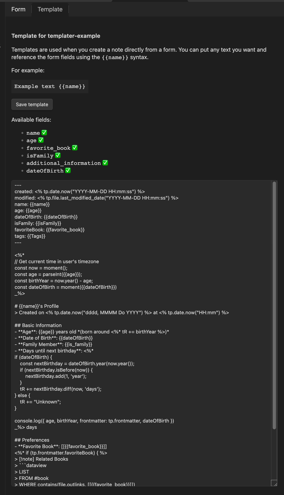
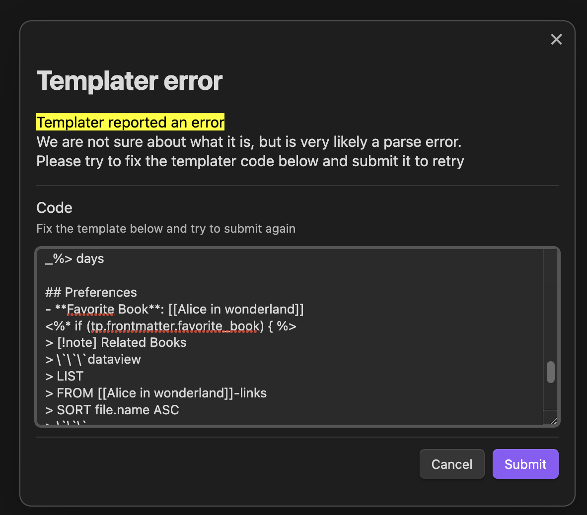

## Templates now support Templater syntax

Modal Form 1.56.0 enhances its templates feature with Templater support!
I'm particularly excited about this integration because, with a little addition we are greatly improving the usability of this plugin, but also Templater.
Now binding a particular form to a complex template is easier than ever, knowing the fields available in the template also becomes a lot easier and I think the overall experience is greatly improved.



### What's New

The Templater integration adds the following capabilities to form templates:

- Use Templater syntax (`<% %>`) inside form templates
- Process dates, files, and system information through Templater
- Automatic processing of Templater syntax after form variables are replaced

Here's a little example combining both syntaxes:

```
---
created: <% tp.date.now() %>
---

Dear {{name}},

Meeting scheduled for <% tp.date.now("MMMM Do, YYYY") %>
Location: {{location}}

Best regards,
{{signature}}
```

### How it Works

The template processing now happens in two stages:

1. First, Modal Form replaces all form variables (the `{{variable}}` syntax)
2. Then, if Templater is available, it processes any Templater syntax in the resulting text

### Retry Functionality

Getting templater templates right at the first try can be hard, that's why we added a retry option when templater processing part fails.
If something goes wrong during templater processing , Modal Form now provides a retry modal where you can try to fix the template and try again.:



This makes it easier to fix any issues without losing your form data and gives you an insight on how te template is processed.

Check out the [templates documentation](/docs/templates) for more details and examples of how to use this new feature.
