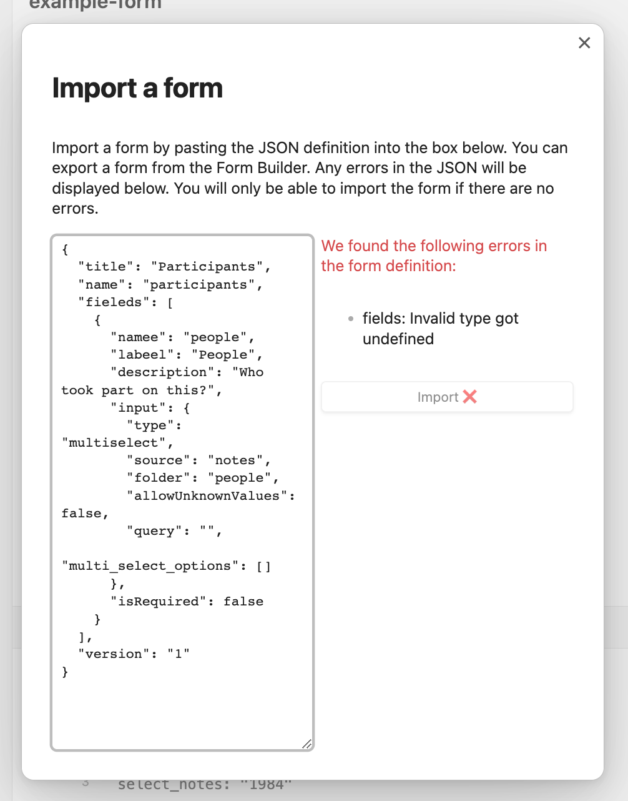

## Importing Forms

Since release 1.40.0 it is possible to import forms from JSON.
You can open the import modal from the command palette or from the forms list.
The command is called `Import Form` for the surprise of no one.
That will present a simple modal with a text area where you can paste the JSON.
Any errors will appear next to the text area if any.
Once you fix the errors you can click the `Import` button which will open the form editor with the imported form.
From there you can do any changes you want and save it.

