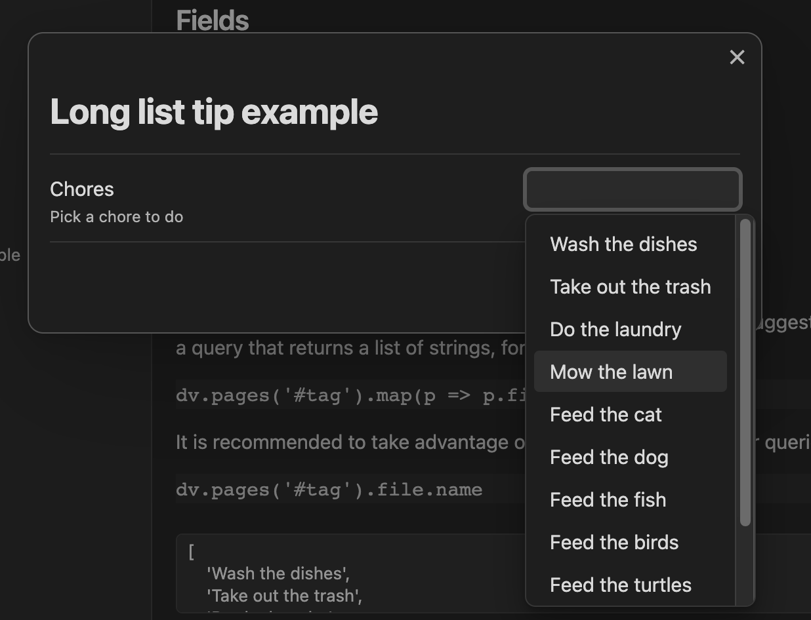
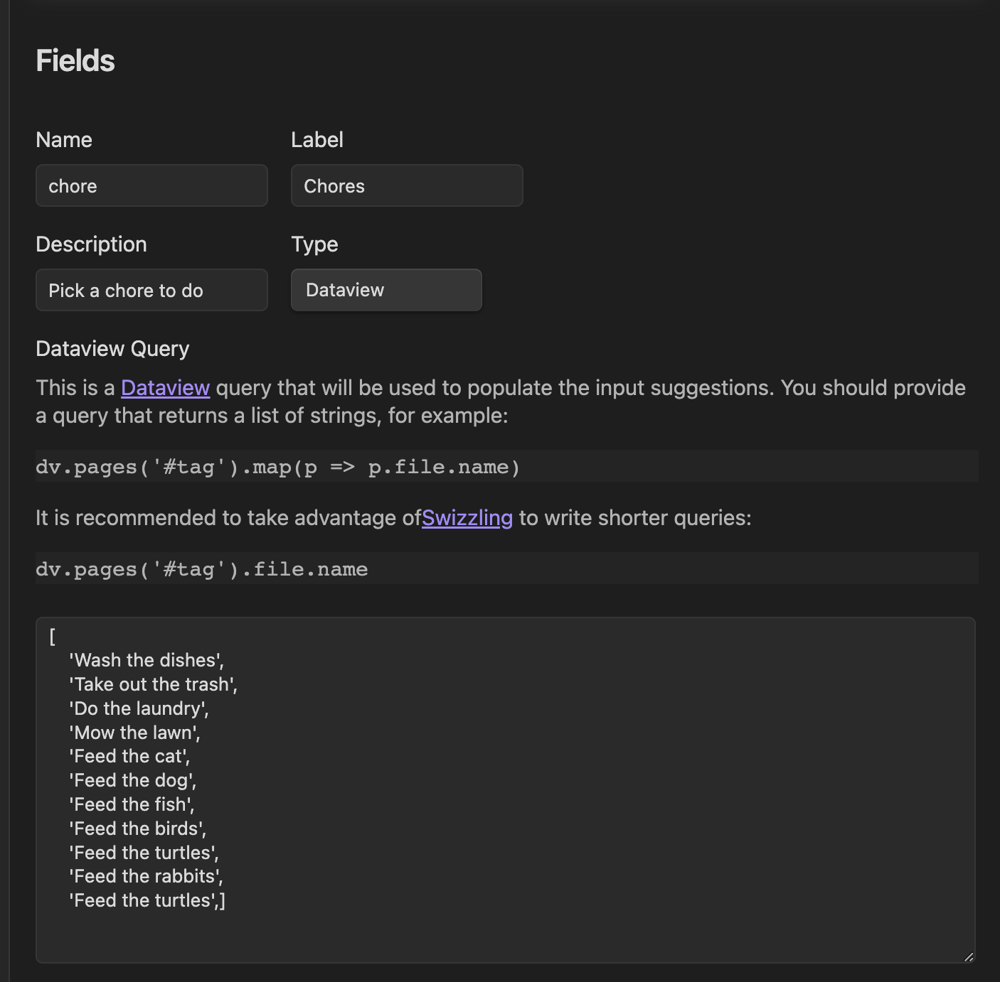

# TIP: How to put a long list of values in a select without having to type them one by one

When you already have a long list of values that you want in a select input, instead of putting them one by one in the fixed list, you can use the `dataview` input type and just return the values as an array in the dataview query.

For example, you can put the following in a select input with `dataview` as the source:

```ts
return [
    'Wash the dishes',
    'Take out the trash',
    'Do the laundry',
    'Mow the lawn',
    'Feed the cat',
    'Feed the dog',
    'Feed the fish',
    'Feed the birds',
    'Feed the turtles',
    'Feed the rabbits',
    'Feed the turtles',]
```

And the result will be:


Here is an screenshot of how it looks in the form builder:

